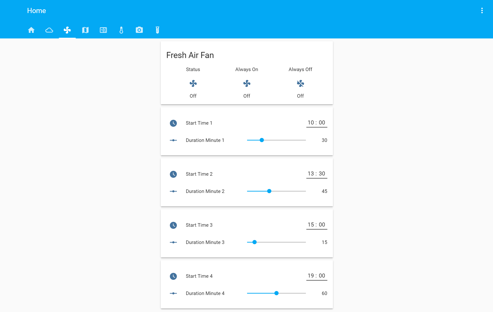
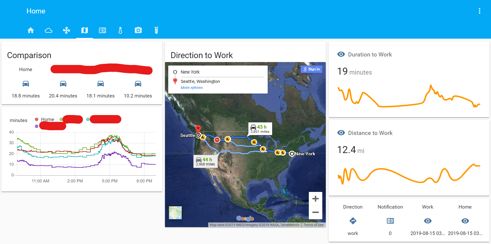
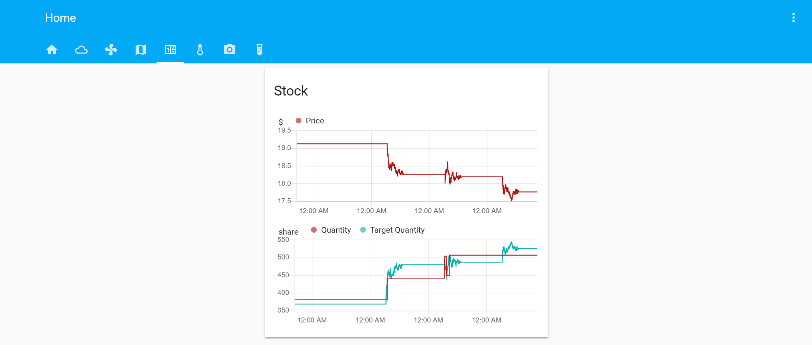

# Home Assistant Configuration

Configuration for [Home Assistant](https://home-assistant.io/) running on a [Raspberry Pi](https://www.raspberrypi.org/products/raspberry-pi-3-model-b/) containing centralized home monitoring, remote control, home automation, traffic monitoring and more.

## Hardware

* Light switch: GE Z-Wave Plus Dimmer
* Lock: Schlage Connect, August 3rd gen
* Garage Door: MyQ
* Thermostat: Nest
* Doorbell: Ring
* Temperature sensor: Xiaomi Aqara
* Relay: Sonoff
* Voice control: Alexa

## Connection

* Connect through Internet: August, MyQ, Nest, Ring, Sonoff, Alexa
* Connect through Z-Wave: GE Z-Wave Plus Dimmer, Schlage Connect
* Connect through LAN: Xiaomi

## UI Components

1. Home tab contains the main controls for locks, garage door, lights, thermostat. It also shows the status of Ring doorbell and multiple temperature and humidity sensors.

    

2. Weather tab shows the weather and the temperature humidity history of 1 day and 7 days.

    

3. Fan tab has the scheduler for the sonoff relay which controls the fresh air damper to refresh the indoor air. It used to be controlled by a 24-hour manual timer. And just like the manual timer, there is an "Always On" and an "Always Off" switch.

    

4. Traffic tab contains the real time travel time between home and work using Google Map API. It also tracks regional traffic by comparing travel time with other routes. The API calls are scheduled to be more frequent during commute hours so it uses the $200 monthly free credit wisely.

    

5. Stock tab monitors the auto trading status of a stock. The value is set by the cloud service that runs the trading algorithm.

    

## Alexa Voice control

Home Assistant is connected to Alexa via [Haaska](https://github.com/auchter/haaska). Haaska runs in an AWS Lambda and bridges between Alexa and Home Assistant. It reports components in Home Assistant to Alexa in a recognizable way, just like the way a Nest server reports Nest thermostat to Alexa.

And after the components are recognized by Alexa as smart devices and scenes, routines are set up in Alexa app for voice control.

For example, a custom command can turn off all lights and lock all doors and let Alexa say a good night phrase. Or a secret command can turn on a Alexa scene that maps to a Home Assistant script to unlock garage entry door. Or 

[Scripts](https://github.com/qchero/HassioConfiguration/blob/master/scripts.yaml) that can be triggered by Alexa through Scenes.

## Automation

* Commute notification: In a workday afternoon, when the travel time is less than X min, send up to 3 notifications to IFTTT app on the phone, in 5 min intervals - [Link](https://github.com/qchero/HassioConfiguration/blob/699532270421fc8014fe2374f30bb7cf3a6f474d/package_navigation.yaml#L291)
* Real time traffic update schedule: Call Map API more often during commute hours, less often in other time of the day and stop calling during the evening and weekends - [Link](https://github.com/qchero/HassioConfiguration/blob/699532270421fc8014fe2374f30bb7cf3a6f474d/package_navigation.yaml#L188)
* Fresh air fan scheduling with always on/off override: Run fans according to the schedule settings including 4 time intervals and the always on and always off switch - [Link](
https://github.com/qchero/HassioConfiguration/blob/10228ff32f683afe077c4215d13d7bba97005c54/package_fresh_air_fan.yaml#L110)

**Note: Private information is stored in secrets.yaml (not uploaded)**
